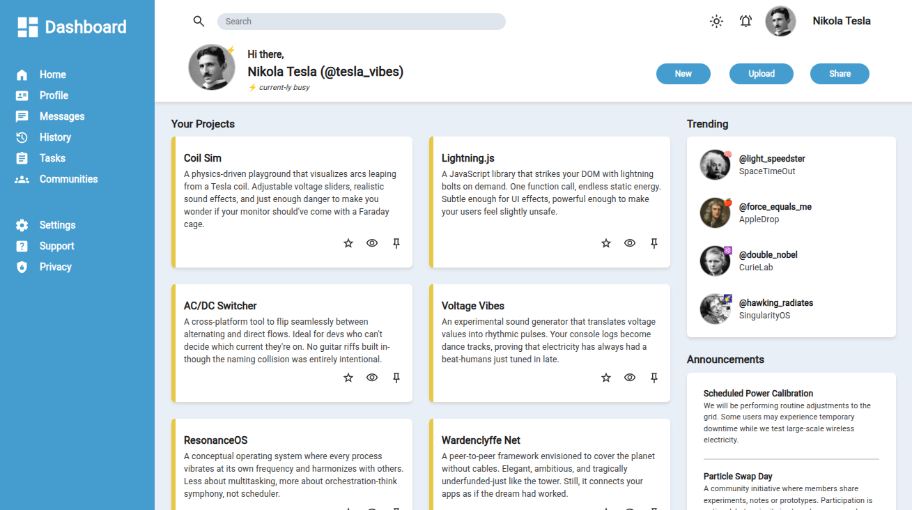
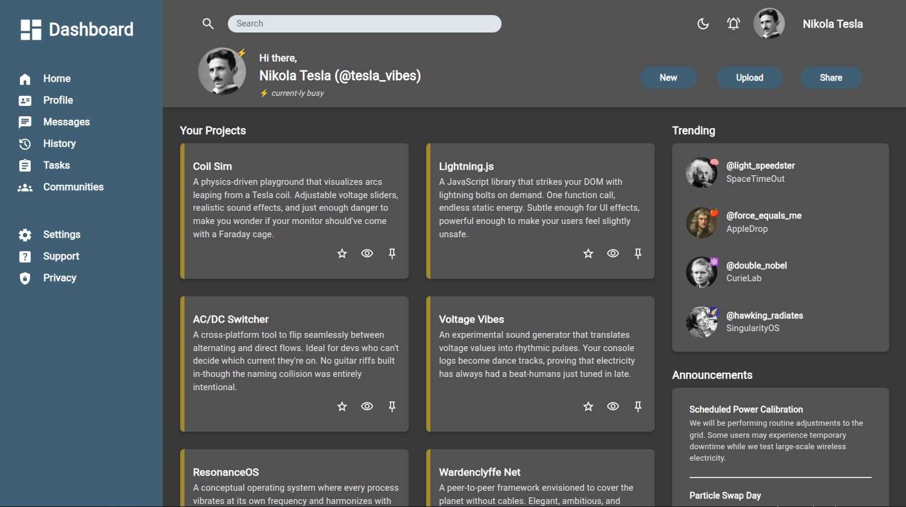
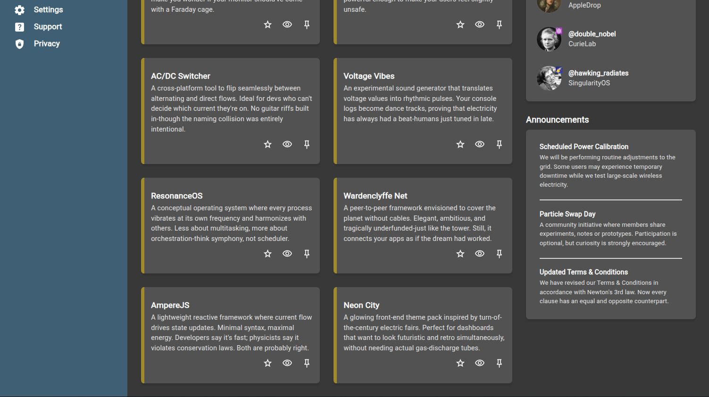
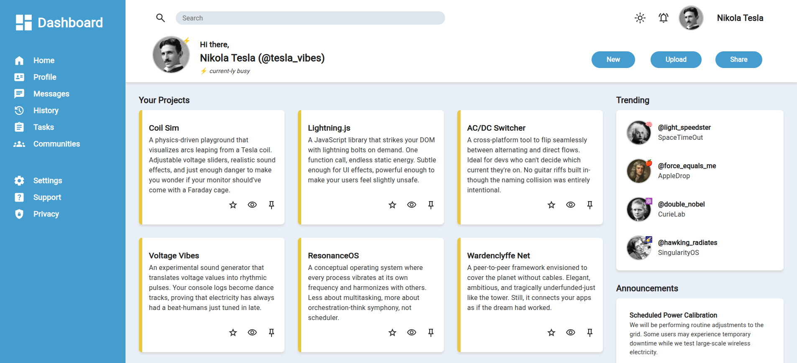

# Admin Dashboard

## Description

- It's a responsive dashboard interface built with HTML, CSS and JavaScript. It includes a sidebar, a header, and a grid-based main content section displaying projects within cards. Some buttons are just decorative.
- The design follows this [reference template image](./assets/ref/admin-dashboard-reference.png).
- **Features:**
    - A grid-based layout
    - Responsive cards that can expand or shrink
    - Light/Dark mode switcher

## Live Demo

**[Click here](https://pedroasb.github.io/admin-dashboard/)** to try out this project on browser.

## Screenshots

## About the Project

This project is part of the curriculum of [The Odin Project](https://www.theodinproject.com/). You can check out other projects that I've built in my [fullstack-journey](https://github.com/PedroASB/fullstack-journey) repository.

## Attributions

- **Fonts**
    - Font copyright © 2011 The Roboto Project Authors – Licensed under the [SIL Open Font License, Version 1.1](https://openfontlicense.org/). Source: https://github.com/googlefonts/roboto-classic
- **Icons**
    - Icons by [Google](https://fonts.google.com/icons) – Licensed under Apache 2.0
- **Images**
    - Nikola Tesla's photograph by Napoleon Sarony - postcard ([radiographics.rsna.org](http://radiographics.rsna.org/)), Public Domain, https://commons.wikimedia.org/w/index.php?curid=26187019
    - Albert Einstein's photograph by Oren Jack Turner, Princeton, N.J. - This image is available from the United States Library of Congress's Prints and Photographs divisionunder the digital ID cph.3b46036.This tag does not indicate the copyright status of the attached work. A normal copyright tag is still required. See Commons:Licensing., Public Domain, https://commons.wikimedia.org/w/index.php?curid=254353
    - Isaac Newton's photograph by Godfrey Kneller - File:Portrait of Sir Isaac Newton, 1689.jpg from https://exhibitions.lib.cam.ac.uk/linesofthought/artifacts, Public Domain, https://commons.wikimedia.org/w/index.php?curid=132521185
    - Marie Curie's photograph by Henri Manuel - [cdn-images-1.medium.com](http://cdn-images-1.medium.com/), Public Domain, https://commons.wikimedia.org/w/index.php?curid=61396200
    - Stephen Hawking's photograph by NASA - Original. Source (StarChild Learning Center). Archived directory listing at the Wayback Machine., Public Domain, https://commons.wikimedia.org/w/index.php?curid=1657641
