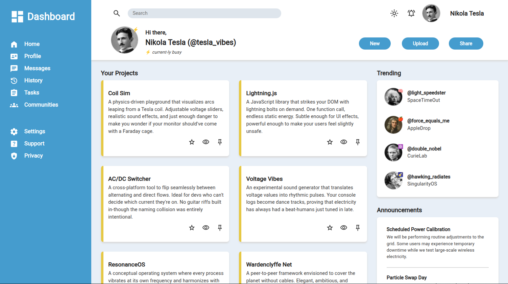

# Admin Dashboard

## Description

HTML + CSS + JavaScript project.

<!-- ## Live Demo

**[Click here](https://pedroasb.github.io/admin-dashboard/)** to try out this project on browser. -->

## Screenshots

## About the Project

This project is part of the curriculum of [The Odin Project](https://www.theodinproject.com/). You can check out other projects that I've built in my [fullstack-journey](https://github.com/PedroASB/fullstack-journey) repository.

<!-- ## Attributions

- [Item](link)
- [Item](link) -->